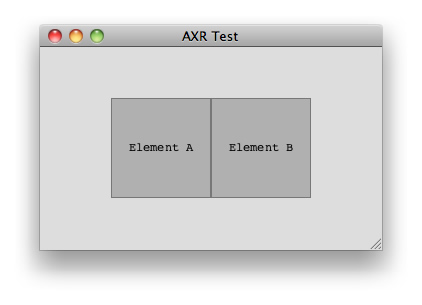
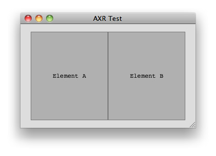
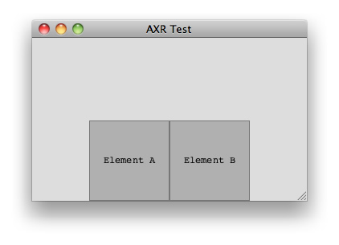

Introduction
------------
HSS is the design language that powers the presentational side of a document
written for the AXR platform. It's syntax is inspired in CSS, but it takes the
concept to a whole new level, providing many new features that enable newfound
flexibility and power.

It was invented by Miro Keller in 2009 and has been evolving since then. The
idea started as a small superset of CSS, but it became clear to the author that
a fresh start would be required because the burden of legacy compatibility was
too high to create a really great language. Thus, the AXR Project was started.

Set-up of the environment
-------------------------
At the time of writing this tutorial, the prototype rendering engine is capable
of handling all the concepts we are going to explore, but it is not available as
a browser plug-in, yet. Thus, you need to download the prototype for your
specific platform from the [project page](http://axr.vg/), and open XML files
located on your local computer.

//FIXME: add instructions on how to install the prototype

Next, you should create a folder somewhere you can remember, and create the text
files that we are going to discuss in these tutorials. The best way is to
manually type the things in yourself, instead of copying and pasting, because
that way you'll learn much more and you'll be much less prone to overlooking
details of the syntax.

For the sake of simplicity, I'll just use paths that start with a slash as if
the files were located in the root of your hard-drive. Please prepend them with
what's missing. Say, for example that I put my files in a new folder on the
desktop, called tutorials. Whenever I see `/index.xml` in the tutorial, the
actual path to that file would be `/Users/Axerr/Desktop/tutorials/index.xml`,
since I am on a Unix-like system.

Configure your text editor to use the UTF-8 encoding, either at the time of the
file creation or in a setting in your application's settings. This encoding is
the official recommended one to use.

Hello world
-----------
The first thing we'll do, to follow the tradition of all programming languages,
is creating the most basic file possible, which gives a basic output.

### Let's rock!
Open your favorite text editor, and create a new file `/hello_world.xml`. Inside
it, write this:

	<?xml version="1.0" encoding="UTF-8" ?>
	<hello>Hello world</hello>

Done! Now, open it in the prototype, and you'll see something like this:

Let's go over each line:

	<?xml version="1.0" encoding="UTF-8" ?>

This is an XML instruction that needs to be present in all XML files, as per the
[specification](http://spec.axr.vg/). We declare the file to use the 1.0 version
of the XML standard, and that our file is encoded in the UTF-8 encoding, which
is what you should always use.

	<hello>Hello world</hello>

The only requirement for the XML file that the AXR platform imposes is that the
XML document is well-formed (//FIXME: add link), and that means, among other
things, that there must be one, and only one, root element that contains all the
other elements. In this case our root element is called `hello`, and it contains
just some content text, `Hello world`

### Style sheets
Now, let's style it up a bit. For that, we need to add a line to the XML file
that will determine how to find the stylesheet that will contain the
instructions on how to represent the content of the XML file:

	<?xml version="1.0" encoding="UTF-8"?>
	<?xml-stylesheet href="style.hss" type="application/x-hss" version="1.0"?>
	<example>Hello world</example>

Here's what we added:

	<?xml-stylesheet href="style.hss" type="application/x-hss" version="1.0"?>

This line is a so called XML instruction, and the instruction name is
`xml-stylesheet`. It's arguments, `href`, `type` and `version` can come in any
order.

- `href` is the location of the HSS file relatively to the XML file. No absolute
  paths or URLs are supported yet in the prototype.

- `type` is the MIME type of the stylesheet. In this case, we are using
  `application/x-hss`, because it is not an official standard yet, and MIME
  rules state that you have to use the `x-` prefix for non-standard types. In
  the future, this may end up being `application/hss` or even `text/hss`

- Last, but not least, it is always required that you declare the `version` of
the AXR platform that you are targeting. In case that the syntax changes in the
future, backwards compatibility modules will be able to render old documents
correctly, becaue they will know what you meant in the first place. So, for now,
we will always be using `1.0`, at least until the first official version has
been completed and released.

Now, with your favorite text editor, create a new file `/style.hss`, and type
this:

	example
	{
		background: #ED;
		textAlign: center;
		contentAlignY: middle;
	}

Go back to the prototype, hit refresh (cmd+R on the Mac, ctrl+R or F5 on Windows
and Linux), and you should get something like this:

Let's go over each part:

	example
	{
		//more stuff here
	}

This is what's called a rule. It begins with a selector, which points to an
element in the XML source tree, which will receive whatever is defined inside of
the block (which starts with `{` and ends with `}`).

	background: #ED;

This is a property definition. First comes the property name, then immediately
after it comes a colon, then optional whitespace, then one or more values, then
more optional whitespace, and finally an end of statement (aka semicolon), which
is optional when the property definition is the last thing in the rule.

In this particular line, we are setting the `background` property of the
`example` element to a light gray (in case, you haven't guessed it, `#ED`
represents a color).

	textAlign: center;

Here we are setting the content text to be center aligned, as you'd do in any
text processor.

	contentAlignY: middle;

And finally, here comes a small taste of the magic of HSS. How many times have
you wanted to do this with CSS? You set the content of the `example` element to
be vertically aligned to the middle, which is equivalent to `50%`. We'll get to
it later in more detail, but for now, know that the root element will always be
as wide and tall as the window.

### Final touch
To wrap up this segment, let's change the font of the text. We are going to use
what's called an object definition, which will be explained more in depth in
further chapters. For now, just copy along. Add the following lines to the
block:

	font: @{
		face: "Impact";
		size: 40;
		color: #C;
	};

The entire file `/style.hss` now looks like this:

	example
	{
		background: #ED;
		textAlign: center;
		contentAlignY: middle;
		font: @{
			face: "Impact";
			size: 40;
			color: #C;
		};
	}

If you reload in the prototype, you should get something like this:

You can recognize a HSS object by the `@`, which is called the object sign. Its
block contains property definitions, like normal rules do. In this concrete
example, the properties `face`, `size` and `color` are the ones we use because
we are defining a `@font` object, which is the default object type for the
`font` property.

If you didn't fully understand what's going on, don't worry. It will become much
clearer as we dive into the full syntax of objects and how to use them.

The basics
----------

### Selectors
Selectors point to the elements in your XML file, to tell the rendering engine
which properties to apply to which object. Create a new text file `/basics.xml`
and type the following:

	<?xml version="1.0" encoding="UTF-8"?>
	<?xml-stylesheet href="basics.hss" type="application/x-hss" version="1.0"?>
	<example>
		<sibling>Element A</sibling>
		<sibling>Element B</sibling>
	</example>

This basic XML file contains a root element called `example`, which contains two
children elements, called `sibling`, which in turn contain `"Element A"` and
`"Element B"` as content text

Create the HSS file: `/basics.hss`, containing the following:

	*
	{
		background: #D;
	}

If you went trough the last tutorial you can probably guess that this is a rule,
and that what's inside the block applies a gray background. The difference is
that instead of targeting the root element with its name, we are using the
universal selector, the star `*`. Open the `/basics.xml` file with the prototype
and you should see something like the following:

### Scope and nesting
If you are familiar with CSS, you may think that this applies to all elements in
the XML source. There is a crucial difference in HSS, and that is the notion of
scope. In the example, only the root element will be selected, because we always
start at root scope. To select elements further down the document tree, you need
to use nesting or combinators (these will be explored later). The scope
restricts what will be selected, and which elements are said to be in scope
depends on where in your HSS file you use a given selector.

In HSS you can put rules inside other rules, this is what's called nesting.
Change your `/basics.hss` file to look like this:

	*
	{
		background: #D;

		sibling
		{
			width: 100;
			height: 100;
			alignY: middle;
			contentAlignY: middle;
			textAlign: center;
			background: #0003;
			border: @{
				size: 1;
				color: #7;
			};
		}
	}

Reload the file and you should see something like this:

Here's what we added:

	sibling
	{
		width: 100;
		height: 100;
		alignY: middle;
		contentAlignY: middle;
		textAlign: center;
		background: #0003;
		border: @{
			size: 1;
			color: #7;
		};
	}

We are selecting all the `sibling` elements inside the previously selected
element, and adding some properties to be able to see them better. Only the two
children of the `example` element are in scope, because we are inside the rule
that selects the `example` element.

### Dissection
Let's go over the property definitions and see what they do:

	width: 100;
	height: 100;

Here we are setting the basic dimensions of the elements to 100 points. These
are resolution independent units of measure, which when the scale factor is 1
are equal to 1 screen pixel. The `width` and `height` properties accept
numbers, percentage numbers or the keyword `content` (plus some advanced things
we won't consider right now). Anywhere numbers are accepted you can also write
expressions, using common mathematical operands, such as `+`, `-`, `*` and `/`.
Parentheses are also allowed, and they are very useful to group expressions.

The default value for `width` is the percentage number `100%` and for `height`
it is the keyword `content`, therefore making them as wide as the parent and as
tall as their content when left to their default values.

Let's experiment a bit: Change the width to 50%. Now your document should look
like this:

Now we want to make them as tall as the window, so we set the height to 100%.

Maybe not completely as tall as the window. Make it 100% - 30. If you resize the
window you'll see that the empty space at the top and bottom will always be 15
points each.

Just to brag, now, we're going to take it a bit to extreme! Make the width
`(100% - (10% + 5))/2`:

OK, this is probably overdoing it :) But this is just to show that you can use
more complicated expressions without problems.

Let's go back to `width: 100; height: 100;` and then look at the next line:

	alignY: middle;

Here we are setting the alignment point in the vertical axis to the keyword
`middle`, which will be automatically converted to `50%`. The default value for
the horizontal axis is already `50%`, that's why we didn't need to use `alignX`
or `contentAlignX` on its parent to have it aligned in the middle horizontally.

If we change this to `top` or `0`, you'll see it sticks to the top:

If we set it to `bottom` or `100%`, it will got to the bottom:

Intermediate values are possible, as well. But before we do that, we first need
to understand the concept of anchor point. Each object in our document has a
point wich will be the reference used when positioning it on the alignment
point. By default, `anchorX` and `anchorY` are `50%` of their width and height,
respectively.
